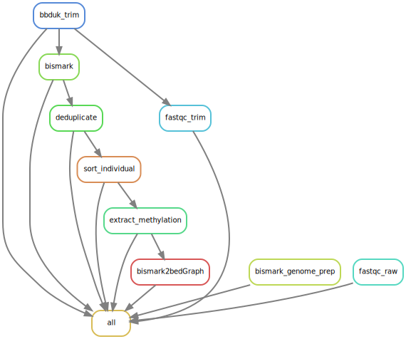

<a href="https://github.com/wegnerce/smk_emseq/releases/"></a>  <a href="#license"></a> <a href="https://python.org" title="Go to Python homepage"></a> <a href="https://snakemake.github.io">
# smk_emseq - A Snakemake-based workflow for EMseq data processing

## :exclamation: Needed/used software
The workflow is based on the following tools: 
- [`fastQC`](https://www.bioinformatics.babraham.ac.uk/projects/fastqc/)
- [`bbduk`](https://jgi.doe.gov/data-and-tools/software-tools/bbtools/)  part of the BBtools suite
- [`bismark`](https://github.com/FelixKrueger/Bismark) 
- [`samtools`](http://www.htslib.org/)

The separate installation of the tools is not necessary, they are installed 'on the fly' (see _Usage_ below).

[`Snakemake`](https://snakemake.github.io/) should be installed as outlined in its [documentation](https://snakemake.readthedocs.io/en/stable/getting_started/installation.html) for instance using [`conda`](https://docs.conda.io/en/latest/miniconda.html)/[`mamba`](https://github.com/conda-forge/miniforge#mambaforge). It is recommended to create a dedicated `conda` environment for Snakemake.

## :blue_book: Description of the workflow
A reference genome stored in `resources/` is bisulfite-treated _in silico_ with `bismark`. Paired-end sequencing data (`stored in data/`) is subjected to quality-control and adapter-trimming using `bbduk`. Quality reports are written using `fastQC` before and after trimming. 

Read pairs are subsequently mapped onto the bisulfite-treated genome, alignments with identical mapping positions are removed. Methylations are extracted for all three contexts (CpG, CHH, CHX) and used to generate a `.bedGraph` and coverage file. The latter can be used for downstream methylation analysis.

The below DAG graph outlines the different processes of the workflow, exemplarily for two file pairs La.1* and Nd.1*.



## :hammer: Usage
Start by cloning the repository and move into respective directory.
```
git clone https://github.com/wegnerce/smk_emseq.git
cd smk_emseq
```
Place paired sequence data (R{1,2}.fastq.gz) in `data/`. The repository contains two pairs of exemplary files (La.1_R1.fastq.gz + La.1_R2.fastq.gz & Nd.1_R1.fastq.gz + Nd.1_R2.fastq.gz).

`config/` contains, besides from the configuration of the workflow (`config/config.yaml`), a tab-separated table `samples.tsv`, which contains a list of all datasets, one per line. The workflow expects `*.fastq.gz`files and `R{1,2}` as prefixes for forward and reverse read files.

From the root directory of the workflow, processing the data can then be started.
```
# --use-conda makes sure that needed tools are installed based
# on the requirements specified in the respective *.yaml in /envs
snakemake  --use-conda
```
The directory structure of the workflow is shown below:
```bash
├── config
│   ├── config.yaml
│   └── samples.tsv
├── dag.svg
├── data
│   ├── La.1_R1.fastq.gz
│   ├── La.1_R2.fastq.gz
│   ├── Nd.1_R1.fastq.gz
│   └── Nd.1_R2.fastq.gz
├── logs
├── LICENSE
├── README.md
├── resources
│   ├── adapters.fa
│   └── RHAL1_chromosome_plasmid.fa
├── results
└── workflow
    ├── envs
    │   ├── bbmap.yaml
    │   ├── bismark.yaml
    │   ├── fastqc.yaml
    │   └── samtools.yaml
    ├── rules
    │   ├── bismark.smk
    │   ├── qc.smk
    │   └── sort.smk
    └── Snakefile
```
Output from the different steps of the workflow are stored in `/results` and `/logs`. 

The resulting `*.cov.gz` files (`results/04_coverage/*.cov.gz`) can be used for downstream methylation analysis.

:copyright: Carl-Eric Wegner

